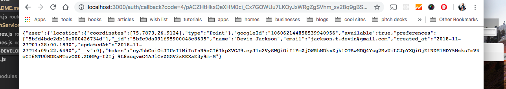

# Backend Developer Coding Challenge
## Project Explanation
When envisioning the task laid out before me and thinking of a database schema, I pictured a online shooter game. Any online shooter game has multiple games in it like Team Deathmatch, Free-for-all, or Capture the Flag. The same way our app has Chess, Risk, and Settlers of Catan.
Online shooters can also add more game modes as time goes on the same way we can add board games.  

For this model to work we must have the idea of a Match model. Something that creates an instance of a game, holds all the players, and says who the host for that match is. Players can create matches and become the host to accept and deny join requests. Once the match is at full capacity it is blocked from accepting anymore.

## Demo API
https://floating-gorge-72290.herokuapp.com/

## Installation
`npm i` or `yarn`


## How to run
Run mongo in the background on another terminal window
`mongod`

Create a .env file on the top level and fill it with the variables below:
* CLIENT_ID - This is the client id from your Google Developer app. This is needed to make Google Oauth2 work
* CLIENT_SECRET - This is the secret to the client id from above
* GOOGLE_CALLBACK -This is the callback route for your Google Oauth2 request. This should be something like localhost:3000/auth/callback
* MONGODB_URI - This is the connection string for your MongoDB. It's used to connect mongoose
* PORT - This is the port your server will run on. This will default to 3000 if not set.
* SECRET_KEY - This is passphrase used to sign and verify encrypted JWT tokens. You can use anything but it's reccomended you use something secure like this: ^+G<Fepnr7DbL[$_

After filling out your env you can run the API with `yarn dev` or `npm run dev`

## How to authenticate use the API
The first step in using the API is to create a user for yourself and get an authentication token to access the API. Most of the API endpoints are secured by a token check. If you don't send a verified token in the headers you will be denied the requested resources. To get your token and create a user, you must go to http://<BASE_URL>/auth/google in your browser with the server running. This will take you to the Google sign in screen. After signing in, you will see an object with your `token` and `user` property on the screen like this:  

  

When making requests to the API take this token and use it in the Authorization header of your requests like so:  
`Authorization: Bearer <token>`


### Endpoints & App Flow

#### Auth
The first thing, as I said above, is to authenticate with the API by creating a user and getting your auth token to place in the Authorization header. Below are the endpoints to do so.

**/auth/google** - This endpoint must be traveled to using the browser. You will have to sign into your google account and give the app access to your email and profile.  

**/auth/callback** - This is where you will be sent to after authenticating with Google Oauth2. The authService helper function will sign a JWT token and send it back in the response for you to use in future queries to the API. You should see the token on the your browser screen after authenticating with Google. Use this in your Authorization header to make future requests.


#### Users
After creating your user and getting your auth token you can do all the basic RESTful functions such as get all users, get a single user, update a single user, or delete a single user. There are also other helpful routes such as adding a game preference and listing players with similar preferences as you.

**/users** - GET - This is a simple GET request endpoint that will return all users.

**/users/:userId** - GET - This endpoint returns one user by the userId in the url params.

**/users/:userId** - PUT - This endpoint is used to update any properties on a user. The input looks like this:  
```
{ updates: {...} }
``` 
The *updates* object should have keys of the properties you want to change and the associated values you want to change it to.

**/users/:userId** - DELETE - This endpoint deletes one user by the userId in the url params.

**/users/similarPlayers** - GET - This endpoint is used to list players that are interested in the same games as you sorted by distance. The input looks like this:  
```
{ 
    userId: String
}
``` 

**/users/addPreference** - PUT - This endpoint is used to add a game preference to a user. The input looks like this:  
```
{ userId: String, gameId: String }
``` 

#### Games
After creating some users you probably want to use that `/addPreference` route to add some games to your interests. Fortunately, you can use these routes below to do RESTful actions on Games. You can list all the games, get one, create one, update one, and delete one. Try listing all the games then adding one of the game _id's as a preference. You can use the `/users/addPreference` route to accomplish this.

**/games** - GET - This endpoint returns all the games in the database.

**/games/:gameId** - GET - This endpoint returns a single game by the `gameId` url param.

**/games** - POST - This endpoint is used to add a new game to list of selectable board games. The input looks like this:  
```
{
    name: String,
    min_players: Number,
    max_players: Number,
}
``` 

**/games/:gameId** - PUT - This endpoint is used to update a single game by the gameId in the url params. The input looks like this:    
```
{
    updates: [{...}],
}
``` 

**/games/:gameId** - DELETE - This endpoint deletes a single game by the `gameId` url param.

#### Matches
Now that we've created some games and added them as preferences, we can start creating some real matches with other players. The endpoints below give the basic RESTful functions like get all open matches, get a single match, create one match, update one match, and delete one match. You can also get all the requests for a specific match

**/matches** - GET - This endpoint is used to list all the open matches that are available to join.

**/matches/:matchId** - GET - This endpoint return a single match by the `gameId` url param.

**/matches/requests/:matchId** - GET - This endpoint returns all the requests for a particular match by the `matchId` url param.

**/matches** - POST - This endpoint is used to create a new match from a game and set its host. The input looks like this:  
```
{
    game: String,
    host: String,
}
```
The *game* property should be a game ID and the *host* should be the creating user ID. The *players* array should only have one user ID in it, which is the host ID.

**/matches/:matchId** - PUT - This endpoint is used to update a match by the `matchId` in the url params. The input looks like this:  
```
{
    updates: [{...}],
}
```

**/matches/:matchId** - DELETE - This endpoint deletes a single match by the `matchId` url param.


#### Requests
After creating a few matches, the next thing to do is have users request to join these matches and accept/deny those requests. If the request is accepted then the associated user will be added to the matches players. See the endpoints below and their RESTful functions:

**/requests** - GET - This endpoint is used to list all the requests in the database

**/requests/:requestId** - GET - This endpoint return a single request by the `requestId` url param.

**/requests** - POST - This endpoint is used to create a request to join a match as a user The input should look like this:  
```
{
    match: String,
    user: String,
}
```  
*match* is the associated match ID, *user* is the requesting user ID.

**/requests/:requestId** - PUT - This endpoint is used to update a request by the `requestId` in the url params. The input looks like this:  
```
{
    updates: [{...}],
}
```


**/requests/:requestId** - PUT - This endpoint is used to accept or deny a specific request (found by the `requestId` url param). The input looks like this:  
```
{
    answer: Boolean, 
    matchId: String, 
    requestId: String
}
```  
*matchId* is the associated match ID, *requestId* is the associated request ID. *answer* is `true` to accept and `false` to deny.

**/requests/:requestId** - DELETE - This endpoint deletes a single request by the `requestId` url param.

### P.S.
Thank you for taking the time out of your busy schedule to look this over. I know this takes a lot out of the day. That being said, I really look forward to hearing back from yo!~
